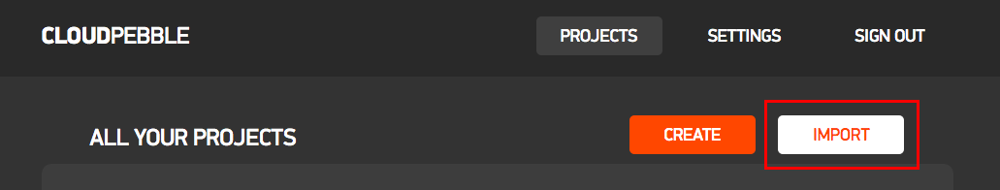

# Equus Perigee

A watch face for the Pebble Time Round, for people who think celestial horse monarchs are pretty neat.

### Installation:

1. Follow the appropriate instructions for enabling the Developer Connection on your Pebble companion app (basically just enable it in the settings, go to its screen, and toggle it on): https://developer.pebble.com/guides/tools-and-resources/developer-connection/
2. Make a free account at cloudpebble.net.
3. Once logged in, click "Import" from the main screen:
   
4. Switch to "Import from GitHub", input "Equus Perigee" in the first field and "github.com/LuminosityXVII/equus-perigee" in the second, and import it (you can change the name to "butts" or something if you want):
   
5. Go to the "Compilation" tab and click "Run Build", then wait a short moment:
   
6. A new section will appear. At this point, you can run it in an emulator if you like; just click "Chalk" (if you want to see how terrible it looks on the Pebble Time or Time Steel, you can enable Basalt in Settings, hit "Run Build" again, and then click Basalt here; Aplite, for the black and white models, won't build).
   Otherwise, switch to "Phone" and click "Install and Run" (make sure you turned on the Developer Connection on your phone!):
   

That should do it. Since I can't test it on an actual Pebble, please let me know if you run into any problems, or anything unexpected. I can be reached at luminosity.xvii@gmail.com, or on my DevArt page if you came from there.

Also, [feel free to donate if you like being philanthropic!](https://paypal.me/LuminosityXVII) It makes me more able to (a) live, and (b) make more stuff.
